# C-CDA Interoperability Hub

A .NET 8 healthcare interoperability platform for generating, validating, importing, reconciling, correcting, exchanging, and governing HL7 C-CDA clinical documents from one secure operations portal.

The C-CDA Interoperability Hub is designed for teams that need to move clinical documents between EHR, EMR, HMIS, HIE, provider portal, patient portal, Direct messaging, and downstream application workflows while preserving auditability, standards validation, and operational control.

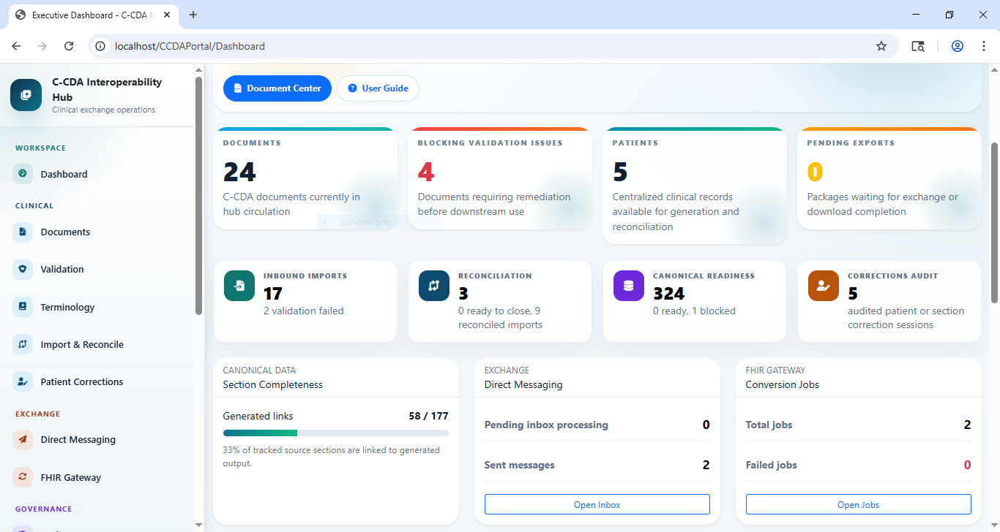

## What This Application Does

The hub centralizes the C-CDA document lifecycle:

- Generates C-CDA R2.1-oriented clinical documents.
- Validates generated and pasted XML using XML parsing, CDA XSD, and C-CDA Schematron assets.
- Imports inbound C-CDA XML from configured source systems.
- Reconciles incoming clinical sections against local patient records.
- Tracks canonical section completeness and generated XML coverage.
- Supports patient identity, demographic, and clinical correction workflows with audit trails.
- Renders generated C-CDA XML as styled XML, raw XML, printable HTML, and export packages.
- Supports Direct messaging and FHIR conversion workflows.
- Provides governance for source systems, users, roles, permissions, settings, audit logs, and background jobs.
- Includes an in-app user guide with usage flows, validation capabilities, and sample validation XML.

## Screenshots

Every screenshot in the `screens` folder is referenced below.

### Authentication And Dashboard

| Secure sign in | Executive dashboard |
| --- | --- |
| 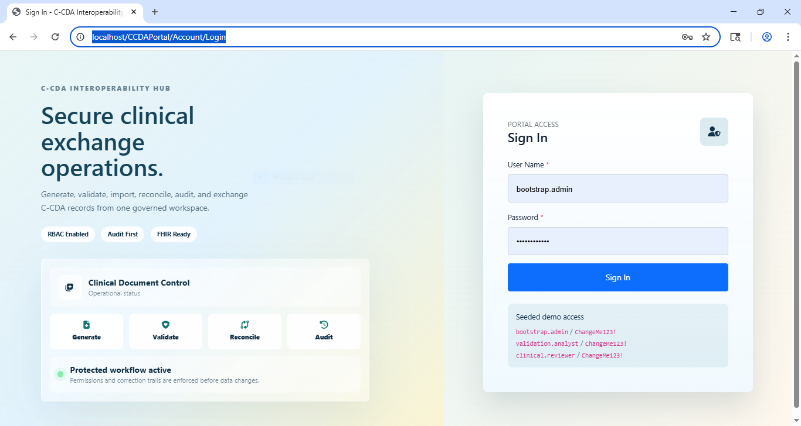 |  |

### Document Lifecycle

| Document management | Document detail |
| --- | --- |
| 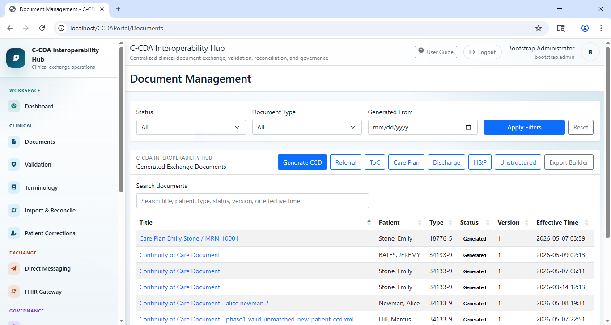 | 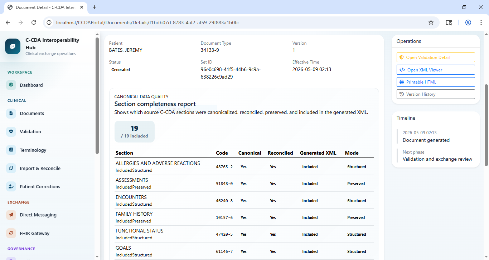 |

| MU3 styled XML viewer | Raw XML viewer |
| --- | --- |
| 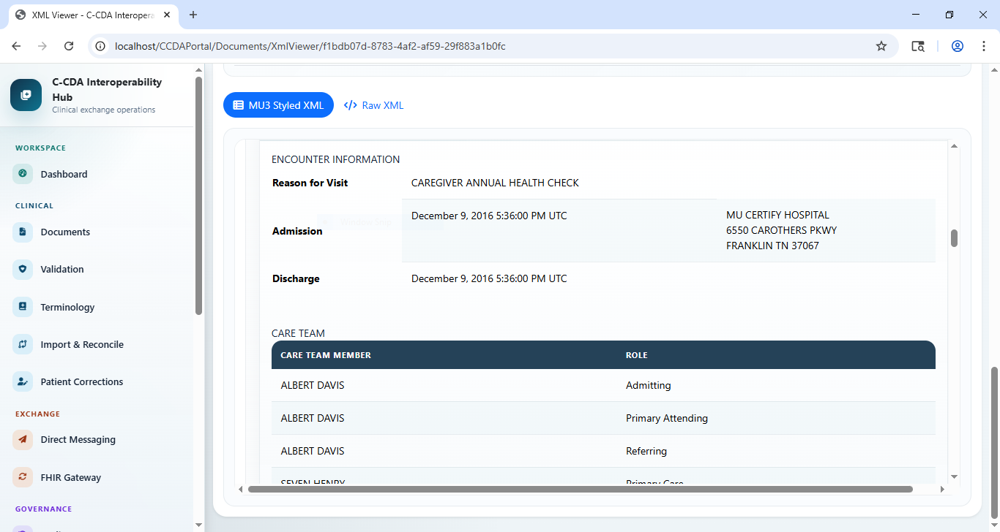 | 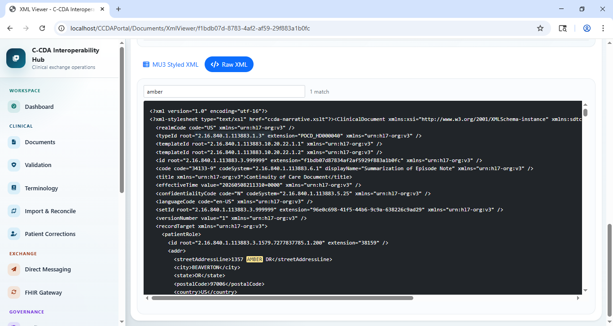 |

| Export package builder | Printable HTML export |
| --- | --- |
| 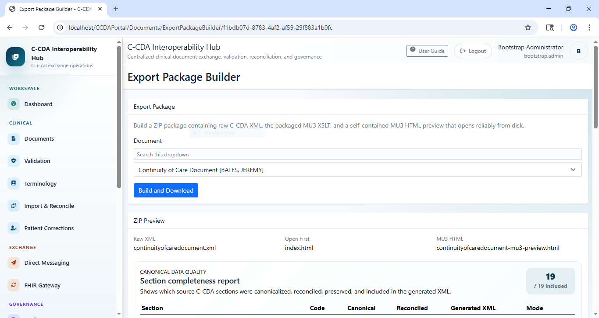 | 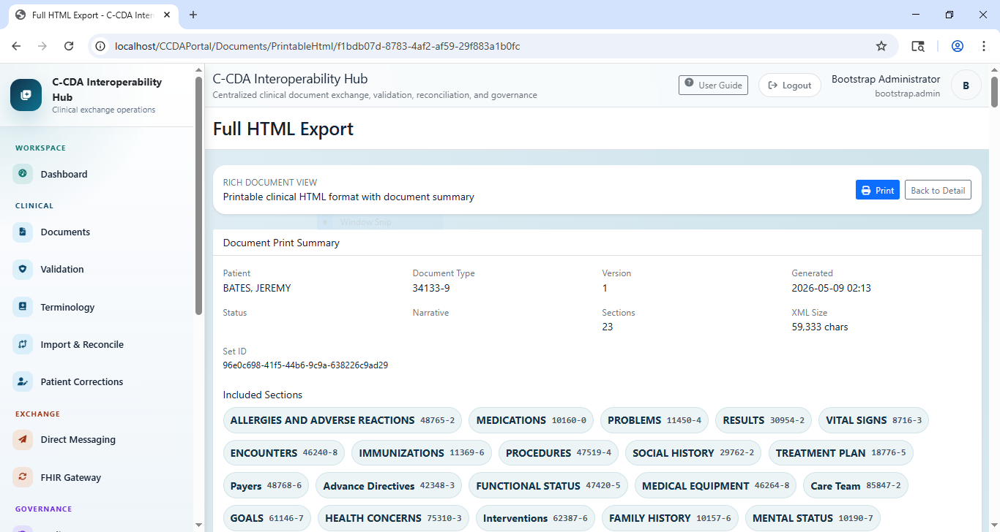 |

### Patient Corrections

| Patient correction workspace | Field-level correction form |
| --- | --- |
| 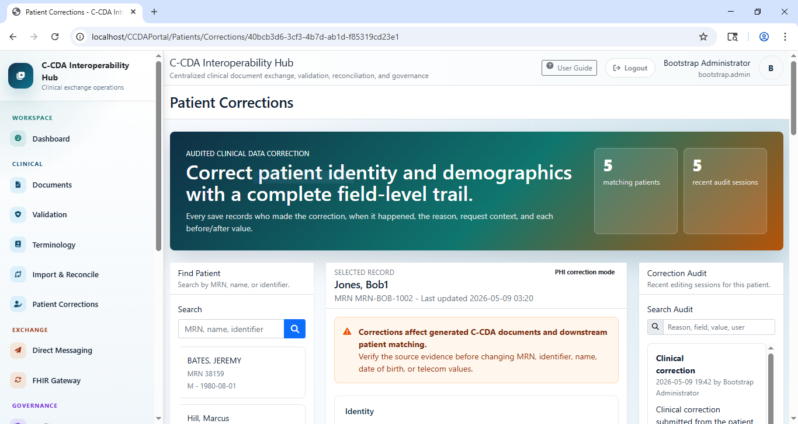 | 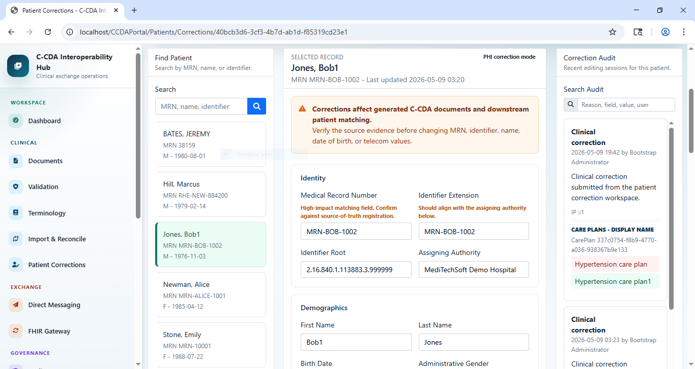 |

### Import, Reconciliation, And Backfill

| Reconciliation workspace | Import C-CDA document |
| --- | --- |
| 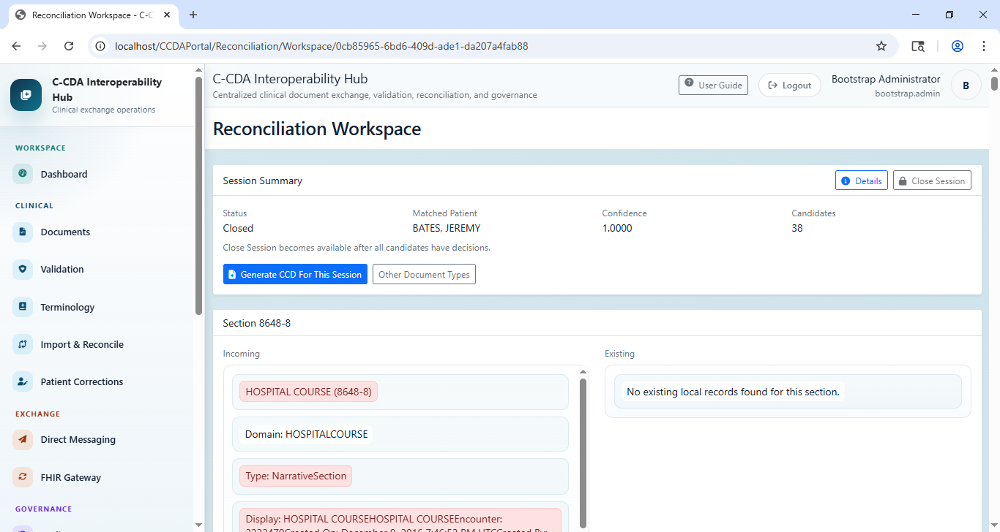 | 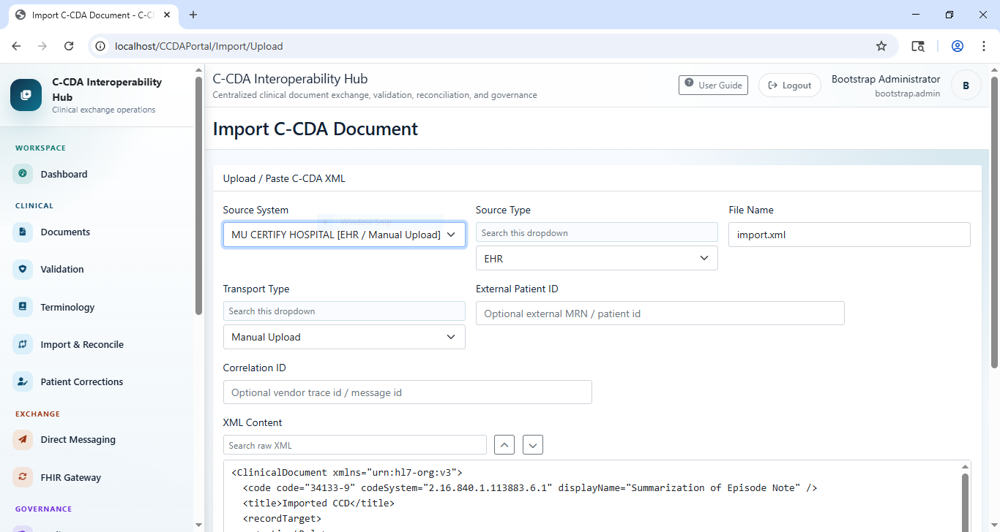 |

| Pending reconciliation review | Canonical backfill blockers |
| --- | --- |
| 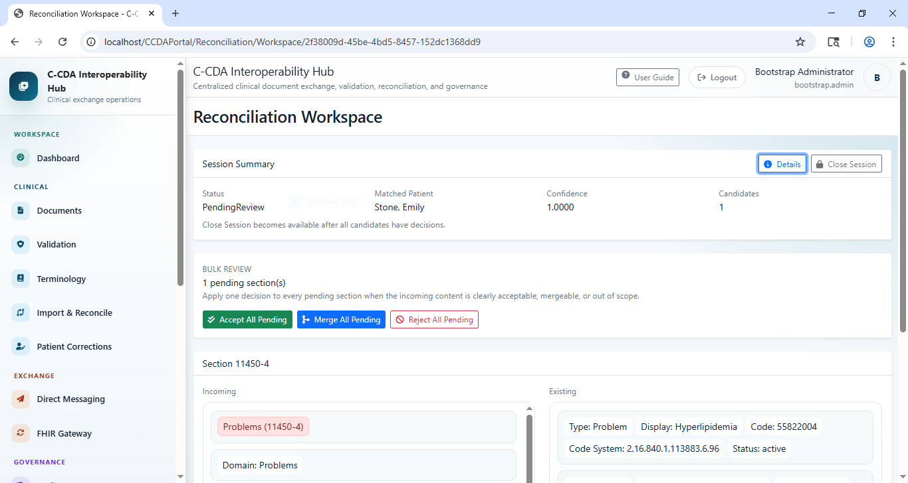 | 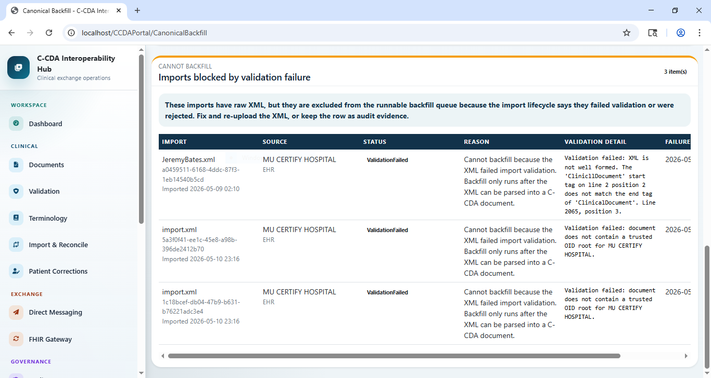 |

### Governance, Security, And Operations

| Audit logs | Source system setup |
| --- | --- |
| 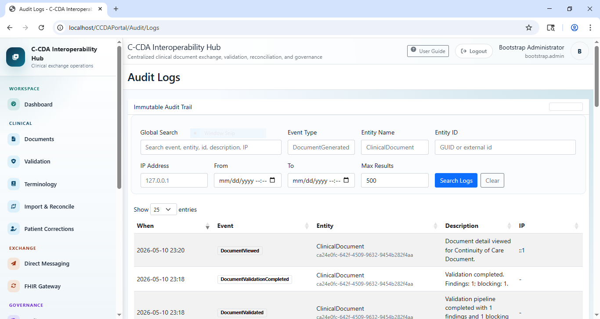 | 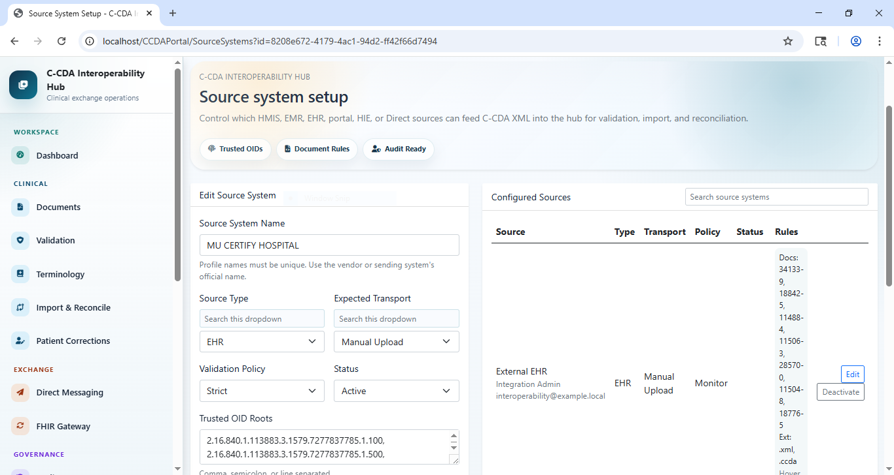 |

| Permission matrix | Settings and standards |
| --- | --- |
| 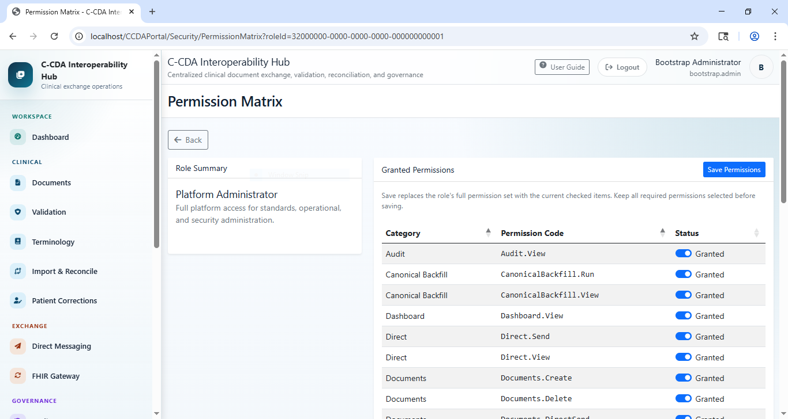 | 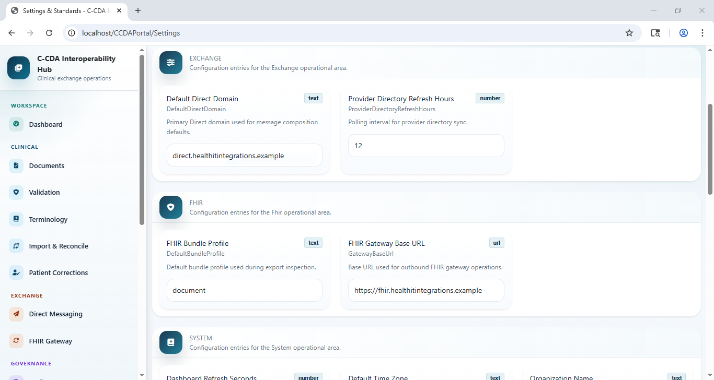 |

| Role catalog |
| --- |
| 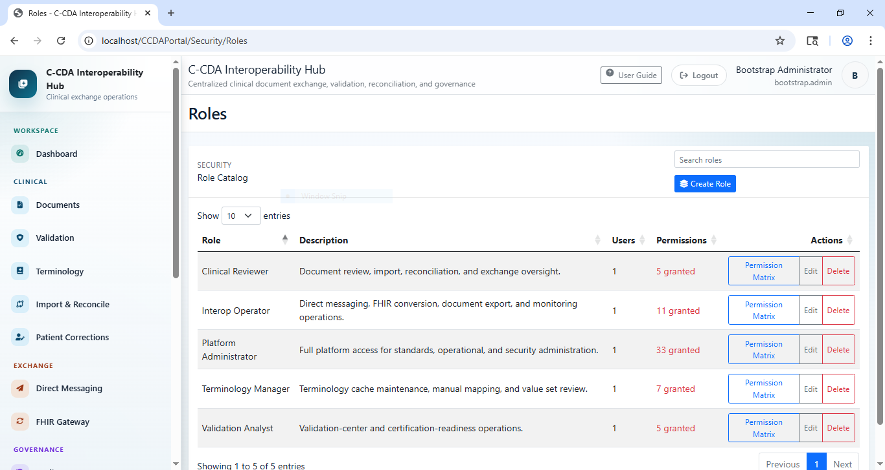 |

## Core Features

### Secure Portal Access

The portal includes role-aware sign-in, permission-controlled navigation, and seeded demonstration accounts for local testing.

Key capabilities:

- Cookie-based portal authentication.
- Permission-filtered sidebar navigation.
- Seeded roles such as Platform Administrator, Validation Analyst, Clinical Reviewer, Terminology Manager, and Interop Operator.
- Audit-first workflow design for clinical and administrative actions.

### Dashboard And Operational Monitoring

The dashboard provides a fast overview of the current interoperability workload.

It summarizes:

- Generated document volume.
- Blocking validation issues.
- Active patient records.
- Pending exports.
- Inbound imports and validation failures.
- Reconciliation workload.
- Canonical readiness and blocked backfill items.
- Correction audit volume.
- Direct messaging and FHIR conversion activity.

### C-CDA Document Generation

The document center manages generated clinical exchange documents and supports multiple C-CDA-oriented document types.

Supported generation workflows include:

- Continuity of Care Document.
- Referral Note.
- Transition of Care.
- Care Plan.
- Discharge Summary.
- History and Physical.
- Unstructured Document.

Generated documents include metadata, patient linkage, version history, XML output, narrative output, validation operations, and export actions.

### XML Review And Human-Readable Rendering

The application supports multiple views of generated C-CDA output:

- MU3 styled XML view.
- Raw XML view with search.
- Printable clinical HTML.
- Self-contained export package previews.
- Document print summary with included section badges.

### Export Package Builder

The export builder creates exchange-ready ZIP packages containing:

- Raw C-CDA XML.
- Rendering XSLT support.
- Self-contained MU3 HTML preview.
- `index.html` entry point for quick review.

### Validation Center

The Validation Center supports validation for stored generated documents and arbitrary pasted XML.

Current validation layers include:

- XML well-formedness checks.
- CDA XSD schema validation.
- C-CDA Schematron conformance validation.
- Vocabulary, datatype, template, section, header, and narrative issues surfaced by XSD or Schematron.
- Optional remote ONC SITE-compatible validation when configured.
- Optional local SITE-style validator adapter when configured.

Validation entry points:

- `Validation Center`: run or re-run validation for stored generated documents.
- `Validation Details`: inspect findings by stage, severity, location, and conformance ID.
- `Validate Pasted XML`: validate arbitrary XML without importing or saving it.
- `Import Upload`: test inbound source-system intake validation.

### Import And Source-System Validation

Inbound C-CDA XML can be pasted or uploaded through the import screen.

Import validation includes:

- Source system/profile checks.
- Source type and transport type checks.
- File extension policy checks.
- XML well-formedness.
- `ClinicalDocument` root and namespace checks.
- Document type code validation.
- Patient identity checks.
- Trusted OID and assigning authority checks.
- Supported clinical section checks.

### Reconciliation Workspace

Imported clinical sections are grouped into reconciliation sessions.

The workspace supports:

- Session summary and matched-patient context.
- Candidate section comparison.
- Incoming vs existing clinical data review.
- Accept, merge, and reject decisions.
- Bulk accept, merge, and reject operations.
- Session closing.
- Generating a CCD from a completed reconciliation session.

### Canonical Backfill

Canonical backfill helps repair or populate canonical clinical records from previously imported XML.

It also identifies imports that cannot be backfilled because they failed validation or were rejected, keeping unsafe data out of downstream canonical records.

### Patient Corrections

The Patient Corrections workspace supports audited correction of patient identity, demographics, and modeled clinical sections.

It includes:

- Patient search by MRN, name, or identifier.
- PHI correction mode.
- Field-level before/after correction trail.
- Correction reason and audit history.
- Clinical section correction support.
- Warnings for changes that affect generated C-CDA documents and patient matching.

### Source System Governance

Source-system profiles control which external systems can feed C-CDA XML into the hub.

Profiles define:

- Source system name.
- Source type.
- Active/inactive status.
- Expected transport type.
- Trusted OID roots.
- Assigning authority names.
- Allowed document type codes.
- Allowed file extensions.
- Validation policy.
- Contact and ownership metadata.

### Audit Logs

The audit module provides searchable event history for clinical, administrative, import, validation, reconciliation, and security-sensitive operations.

Search fields include:

- Global text search.
- Event type.
- Entity name.
- Entity ID.
- IP address.
- Date range.
- Result limit.

### Role-Based Access Control

Security administration includes:

- User administration.
- Role catalog.
- Permission catalog.
- Permission matrix by role.
- Dynamic sidebar filtering based on granted permissions.
- Platform roles for administration, validation, clinical review, terminology, and interoperability operations.

### Settings And Standards

The settings screen centralizes operational configuration for:

- System behavior.
- Validation assets.
- Terminology endpoints.
- Exchange defaults.
- Direct messaging.
- FHIR gateway settings.

### Direct Messaging And FHIR Gateway

The platform includes service and UI foundations for:

- Direct inbox.
- Direct sent messages.
- Direct compose.
- Provider directory search.
- C-CDA-to-FHIR conversion jobs.
- FHIR conversion result review.

## Solution Architecture

The solution follows a layered dependency model:

```text
Domain -> Application -> Infrastructure -> Api / WebPortal / Workers
```

| Path | Purpose |
| --- | --- |
| `src/Domain` | Healthcare domain entities, value objects, constants, document models, clinical models, audit models, security models, and integration models. |
| `src/Application` | DTOs, service contracts, request/response models, authorization models, and application interfaces. |
| `src/Infrastructure` | EF Core persistence, SQL Server services, C-CDA generation, validation pipeline, import/reconciliation, terminology, Direct, FHIR, settings, audit, and authentication/authorization implementations. |
| `src/Api` | ASP.NET Core REST API with Swagger/OpenAPI. |
| `src/WebPortal` | Razor Pages operations portal. |
| `src/Workers` | Background worker host for scheduled or long-running jobs. |
| `tests/Project.Tests.Unit` | Unit tests. |
| `tests/Project.Tests.Integration` | Integration tests. |
| `tools/validation` | CDA XSD, C-CDA Schematron, ISO Schematron, Saxon HE, compiled XSLT, and runtime validation files. |
| `tools/SchemaExporter` | Utility for exporting EF Core schema SQL. |
| `docs` | User guides, runbooks, deployment notes, SQL scripts, and operational documentation. |
| `screens` | GitHub README screenshots. |

## Technology Stack

- .NET 8
- C# 12
- ASP.NET Core Razor Pages
- ASP.NET Core Web API
- Entity Framework Core 8
- SQL Server / SQL Server Express / SQL Server LocalDB-compatible configuration
- Bootstrap 5
- Font Awesome
- DataTables
- Chart.js
- xUnit
- Swashbuckle/OpenAPI
- Saxon HE for Schematron execution
- HL7 CDA XSD and C-CDA Schematron validation assets

## Validation Assets

Real C-CDA validation requires assets under `tools/validation`:

| Folder | Purpose |
| --- | --- |
| `tools/validation/xsd` | HL7 CDA XSD schema set. |
| `tools/validation/schematron` | HL7 C-CDA Schematron source and `voc.xml`. |
| `tools/validation/iso-schematron` | ISO Schematron transformation stylesheets. |
| `tools/validation/bin` | Saxon HE jar as `saxon-he.jar`. |
| `tools/validation/compiled` | Compiled C-CDA validator XSLT and copied `voc.xml`. |
| `tools/validation/runtime` | Temporary runtime validation files. |

The application resolves validation paths from both the WebPortal content root and the repository root, so repo-root `tools/validation/...` assets can be used by the portal.

## API Overview

The API project exposes integration endpoints for:

- Health and dashboard summary.
- Document generation.
- Document retrieval.
- XML and narrative access.
- Validation pipeline operations.
- Terminology cache, resolution, unmapped review, manual maps, and value sets.
- C-CDA import.
- Reconciliation sessions and decisions.
- Direct messaging.
- FHIR conversion.
- Audit logs and background jobs.
- Users, roles, permissions, and role permission assignments.

Swagger is available at `/swagger` when `src/Api` is running.

## Prerequisites

- .NET 8 SDK
- SQL Server, SQL Server Express, or SQL Server LocalDB
- PowerShell
- Java runtime for Schematron validation through Saxon HE
- Optional: real HL7 validation assets under `tools/validation`

Check Java:

```powershell
java -version
```

## Getting Started

From the repository root:

```powershell
dotnet restore CcdaEngine.sln
dotnet build CcdaEngine.sln
```

Start SQL Server LocalDB if using LocalDB:

```powershell
sqllocaldb start MSSQLLocalDB
```

Run the API:

```powershell
dotnet run --project src\Api\Project.Api.csproj
```

Run the Web Portal:

```powershell
dotnet run --project src\WebPortal\Project.WebPortal.csproj
```

Run workers when needed:

```powershell
dotnet run --project src\Workers\Project.Workers.csproj
```

Run tests:

```powershell
dotnet test CcdaEngine.sln
```

## Configuration

Runtime settings live in:

- `src/Api/appsettings.json`
- `src/WebPortal/appsettings.json`

Important configuration areas:

- `ConnectionStrings:DefaultConnection`
- `Validation`
- `Terminology`
- `Logging`

Validation configuration includes:

- XSD directory
- Schematron directory
- Schematron source file
- ISO Schematron directory
- compiled XSLT path
- Saxon jar path
- remote ONC SITE toggle
- local SITE toggle
- timeout behavior

## Database Assets

SQL assets are stored in `docs`:

- `CcdaEngine.Schema.sql`
- `CcdaEngine.SeedData.sql`
- `CcdaEngine.SystemSettings.sql`
- `CcdaEngine.NormalizeSearchColumns.sql`
- `CcdaEngine.PerformanceIndexes.sql`
- `CcdaEngine.SchemaVerification.sql`
- `GrantBootstrapAdminPermissions.sql`
- `GrantPostBootstrapFunctionPermissions.sql`
- `VerifyBootstrapAdminPermissions.sql`

## Seeded Demo Users

The local demo environment includes seeded users such as:

| User | Purpose |
| --- | --- |
| `bootstrap.admin` | Full platform administration. |
| `validation.analyst` | Validation-center and certification-readiness workflows. |
| `clinical.reviewer` | Clinical document review, import, and reconciliation workflows. |

Credentials are shown on the local sign-in page for demo environments.

## Documentation

See `docs/README.md` for the complete documentation index.

Recommended reading:

- `docs/END_USER_QUICK_START.md`
- `docs/WEB_PORTAL_USER_GUIDE.md`
- `docs/ADMIN_USER_GUIDE.md`
- `docs/RUN_APP.md`
- `docs/DeploymentGuide.md`
- `docs/Runbook.md`

## Project Status

This repository contains a working interoperability hub foundation with generated-document workflows, validation infrastructure, C-CDA import/reconciliation, canonical data operations, correction auditing, source-system governance, RBAC, and operational dashboards.

Advanced future capabilities may include:

- Intelligent patient matching.
- Cross-document clinical reconciliation intelligence.
- Clinical realism validation.
- Narrative vs structured semantic comparison.
- Longitudinal patient timeline validation.
- Source reliability scoring.
- Interoperability confidence scoring.
- Advanced FHIR transformation validation.

## License

Add the appropriate project license before publishing publicly.
