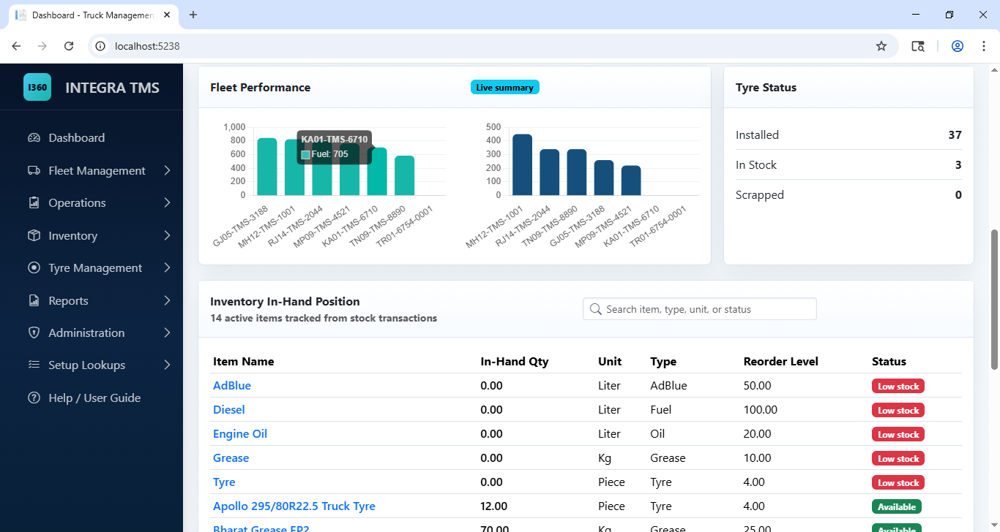
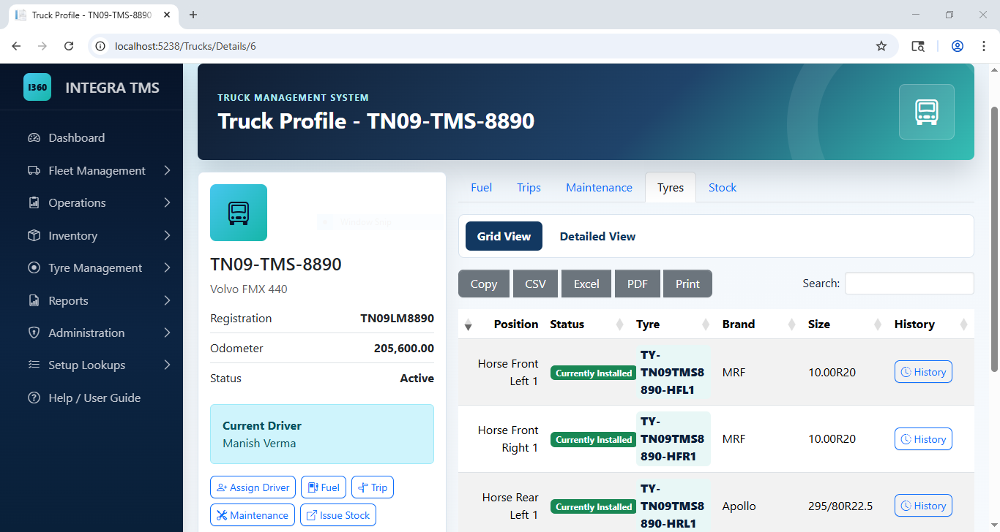
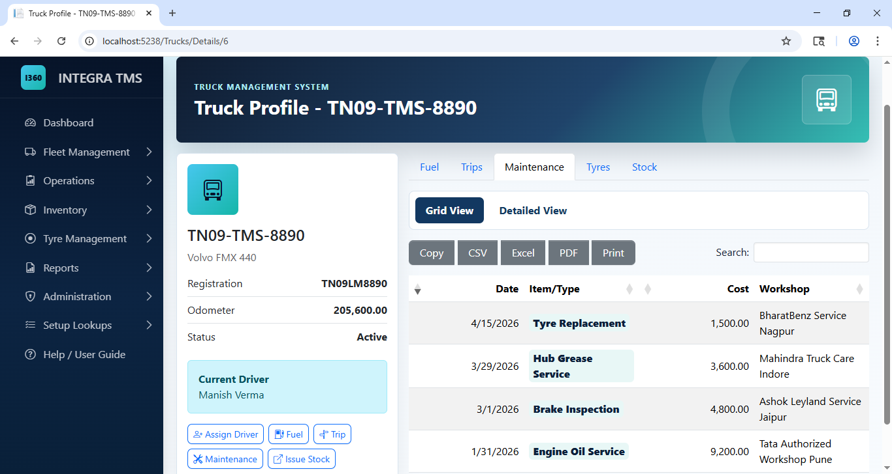

# Truck Management System

Truck Management System is an ASP.NET Core 9 MVC web application for fleet, driver, inventory, fuel, trip, maintenance, tyre, audit, RBAC, and reporting operations. It is built against the existing SQL Server database `TruckManagementDB` and follows a modular INTEGRA-style enterprise layout.

## Quick Links

- User guide: [docs/UserGuide.md](docs/UserGuide.md)
- Main database script: [schema/TMS-DB.sql](schema/TMS-DB.sql)
- Web app: [src/TMS.Web](src/TMS.Web)
- Solution file: [TruckManagementSystem.sln](TruckManagementSystem.sln)

## Technology Stack

- ASP.NET Core 9 MVC
- Entity Framework Core 9
- SQL Server
- Cookie authentication
- Claims-based RBAC
- Serilog rolling file logs
- AdminLTE, Bootstrap 5, Bootstrap Icons
- jQuery, DataTables, Select2-style searchable dropdown behavior, SweetAlert2, Toastr, Chart.js
- xUnit tests

## Solution Structure

```text
TruckManagementSystem.sln
src/
  TMS.Domain/          Entities and domain contracts
  TMS.Application/     Interfaces, result models, service contracts
  TMS.Infrastructure/  EF Core DbContext, repositories, unit of work, auth, seeding
  TMS.Web/             MVC controllers, views, UI assets, middleware, helpers
tests/
  TMS.Tests/           Basic service and infrastructure tests
schema/                Database, lookup, audit, seed, report, and permission scripts
docs/                  Operator and setup documentation
screens/               Application screenshots for documentation
```

## Current Application Configuration

The active web configuration is in `src/TMS.Web/appsettings.json`.

```json
{
  "ConnectionStrings": {
    "DefaultConnection": "Server=DESKTOP-1PDQRLS;Database=TruckManagementDB;User Id=dev_zyzx;Password=pwd_zyzx;MultipleActiveResultSets=true;TrustServerCertificate=True;Connect Timeout=15"
  },
  "Serilog": {
    "MinimumLevel": {
      "Default": "Information",
      "Override": {
        "Microsoft": "Warning",
        "Microsoft.EntityFrameworkCore.Database.Command": "Warning"
      }
    }
  },
  "AllowedHosts": "*"
}
```

Runtime behavior:

- Auth cookie name: `TMS.Auth`
- Login path: `/Account/Login`
- Access denied path: `/Account/AccessDenied`
- Cookie expiry: 10 hours with sliding expiration
- Data protection keys: `src/TMS.Web/DataProtectionKeys`
- Serilog files: `src/TMS.Web/logs/tms-YYYYMMDD.log`
- Driver document upload folder: `src/TMS.Web/wwwroot/uploads/driver-documents`

## Screenshots

GitHub image paths are case-sensitive. The screenshots in this repository use uppercase `.PNG` filenames, so the README references the files exactly as committed.

| # | Screenshot |
| --- | --- |
| 1 |  |
| 2 |  |
| 3 |  |
| 4 |  |
| 5 |  |
| 6 |  |
| 7 |  |
| 8 |  |
| 9 |  |
| 10 |  |
| 11 |  |
| 12 |  |

## Database Script Execution Sequence

Run scripts in SQL Server Management Studio or Azure Data Studio against the SQL Server instance that will host `TruckManagementDB`.

### Required Foundation

1. Run [schema/TMS-DB.sql](schema/TMS-DB.sql)
   - Creates `TruckManagementDB`
   - Creates core tables
   - Creates reporting views:
     - `vw_TruckFuelSummary`
     - `vw_TruckKmSummary`
     - `vw_StockBalance`
   - Seeds default roles and permissions from the original schema

2. Run [schema/TMS-Rename-DataEntry-To-Staff.sql](schema/TMS-Rename-DataEntry-To-Staff.sql) if your database has the old `Data Entry` role.
   - Renames or merges `Data Entry` into `Staff`
   - Preserves existing user-role and role-permission assignments

3. Run [schema/TMS-Lookup-Tables.sql](schema/TMS-Lookup-Tables.sql)
   - Creates lookup tables for dropdown values
   - Seeds Indian truck companies, models, item types, units, fuel stations, locations, workshops, tyre brands, tyre sizes, statuses, and positions

4. Run [schema/TMS-Driver-Documents.sql](schema/TMS-Driver-Documents.sql)
   - Creates `DriverDocuments`
   - Enables license front/back and Aadhaar front/back upload metadata

5. Run [schema/TMS-Audit-Migration.sql](schema/TMS-Audit-Migration.sql)
   - Adds optional audit columns to key tables
   - Creates `AuditLogs`
   - Enables the Audit Logs screen to show application audit records

6. Run [schema/TMS-New-Menu-Permissions.sql](schema/TMS-New-Menu-Permissions.sql)
   - Adds lookup and audit menu permissions
   - Assigns permissions to Admin, Manager, Staff, and Viewer where appropriate

7. Run [schema/TMS-Override-Permissions.sql](schema/TMS-Override-Permissions.sql)
   - Adds `STOCK_OVERRIDE`
   - Adds `ODOMETER_OVERRIDE`
   - Assigns both to Super Admin only

### Optional Reporting Optimization

8. Run [schema/TMS-Report-Procedures.sql](schema/TMS-Report-Procedures.sql)
   - Adds optional stored procedures for report access
   - The application can still run with EF/view-backed reporting if this is not installed

### Optional Demo and Training Data

Run these only in demo, training, or development databases:

9. [schema/TMS-Seed-India-SampleData.sql](schema/TMS-Seed-India-SampleData.sql)
10. [schema/TMS-Seed-Missing-Tyre-Positions.sql](schema/TMS-Seed-Missing-Tyre-Positions.sql)
11. [schema/TMS-Seed-Installed-Tyres.sql](schema/TMS-Seed-Installed-Tyres.sql)
12. [schema/TMS-Seed-Tyre-Replacement-History.sql](schema/TMS-Seed-Tyre-Replacement-History.sql)
13. [schema/TMS-Seed-Fuel-History.sql](schema/TMS-Seed-Fuel-History.sql)
14. [schema/TMS-Seed-Trip-History.sql](schema/TMS-Seed-Trip-History.sql)
15. [schema/TMS-Seed-Maintenance-History.sql](schema/TMS-Seed-Maintenance-History.sql)
16. [schema/TMS-Seed-Stock-History.sql](schema/TMS-Seed-Stock-History.sql)

## Default Login

The startup seeder creates the default user if it does not exist.

- Username: `superadmin`
- Email: `admin@tms.local`
- Password: `Admin@12345`
- Role: `Super Admin`

The password is stored as a PBKDF2 hash and salt. It is not stored as plain text.

Default roles:

- Super Admin
- Admin
- Manager
- Staff
- Viewer

## Build and Run Locally

Prerequisites:

- .NET 9 SDK
- SQL Server or SQL Server Express
- Node packages already restored in this workspace if local vendor assets are needed

Commands:

```powershell
dotnet restore TruckManagementSystem.sln
dotnet build TruckManagementSystem.sln
dotnet run --project src/TMS.Web/TMS.Web.csproj
```

Open the URL printed by `dotnet run`. The development profile commonly uses `http://localhost:5238`.

Alternative helper:

```powershell
.\run-tms-web.cmd
```

This runs the app at `http://localhost:5088` using `--no-build`.

## Modules

### Dashboard

- Active trucks and active drivers
- Total fuel and total KM
- Maintenance due and overdue counts
- License expiry alerts
- Low stock count
- Tyre installed, in-stock, and scrapped counts
- Current assignments
- Unassigned active trucks
- Drivers missing document uploads
- Trips and fuel for the current month
- Inventory in-hand grid with search
- Fuel and KM charts by truck
- Recent fuel and trip tables

### Fleet Management

- Trucks
  - Add, edit, view, activate/deactivate
  - Full truck profile
  - Profile tabs for fuel, trips, maintenance, tyres, and stock
  - Grid View and Detailed View in profile tabs
  - Tyre history modal by truck position
  - Create truck with AJAX tyre installation workflow

- Drivers
  - Add, edit, view, activate/deactivate
  - License expiry tracking
  - Aadhaar field
  - Profile with assignment, fuel/trip, and document history
  - License front/back and Aadhaar front/back upload

- Assignments
  - Assign driver to truck
  - Close previous current assignment
  - Prevent duplicate active driver/truck assignments

### Operations

- Fuel Entries
  - Truck, driver, fuel type, quantity, rate, station, odometer
  - Odometer validation
  - Truck odometer update

- Trip Logs
  - Route, old KM, new KM, total KM
  - Odometer validation
  - Truck odometer update

- Maintenance Logs
  - Maintenance type, workshop, cost, odometer, next due date/KM
  - Inventory consumption rows for non-tyre maintenance
  - Tyre Replacement workflow with tyre installation grid
  - Odometer validation
  - Maintenance due alerts

### Inventory

- Inventory Items
  - Item master, type, unit, reorder level
  - In-hand quantity shown in grid

- Stock Transactions
  - Opening
  - Purchase
  - Issue to truck
  - Return
  - Adjustment
  - Negative stock prevention
  - `STOCK_OVERRIDE` permission for exceptional negative stock with required remarks

### Tyre Management

- Tyre master
- Tyre installation
- Tyre removal
- Tyre scrap workflow
- Position validation
- Installed and removed KM tracking
- Complete truck-position tyre history

### Reports

- Truck Fuel Summary
- Truck KM Summary
- Stock Balance
- Fuel Consumption
- Trip Report
- Maintenance Report
- Driver Assignment Report
- Tyre Usage Report
- Low Stock Report
- License Expiry Report
- Maintenance Due Report
- Export to Excel/PDF/print through DataTables buttons

### Administration

- Users
- Roles
- Permissions
- Assign roles to users
- Role permission matrix
- Login history
- Audit logs with table/action/user/date/search filters
- Permission-based menus and buttons

### Setup Lookups

- Truck companies
- Truck models
- Inventory item types
- Units
- Stock transaction types
- Fuel types
- Fuel stations
- Locations
- Workshops
- Tyre brands
- Tyre sizes
- Tyre statuses
- Tyre positions

## Security and Business Rules

- Cookie authentication
- Claims-based permissions
- `[HasPermission]` authorization filter
- Permission-based sidebar rendering
- Anti-forgery tokens on forms
- Server-side validation
- Required field styling on data entry screens
- Regex validation for email, mobile, truck number, registration, username, Aadhaar, and license-like fields
- Password hashing with PBKDF2
- Login history recording
- Serilog logging
- Audit writer for create/edit/delete/upload-style events when audit migration is installed

Important controlled overrides:

- `STOCK_OVERRIDE`
  - Allows approved negative stock issue
  - Requires a meaningful reason in remarks
  - Assigned to Super Admin by default

- `ODOMETER_OVERRIDE`
  - Allows exceptional entries below latest known odometer
  - Assigned to Super Admin by default

## Logs and Troubleshooting

Application logs are written to:

```text
src/TMS.Web/logs/tms-YYYYMMDD.log
```

Common checks:

- If login fails, confirm `AppUsers`, `Roles`, `UserRoles`, `Permissions`, and `RolePermissions` are seeded.
- If lookup dropdowns are empty, run `schema/TMS-Lookup-Tables.sql`.
- If driver document upload fails, run `schema/TMS-Driver-Documents.sql` and verify write permission on `wwwroot/uploads/driver-documents`.
- If Audit Logs are empty, run `schema/TMS-Audit-Migration.sql` and perform a create/edit/delete action after login.
- If report procedure mode is required, run `schema/TMS-Report-Procedures.sql`.

## Testing

```powershell
dotnet test tests/TMS.Tests/TMS.Tests.csproj
```

Current test coverage is basic and focused on infrastructure/password services. Broader enterprise service tests can be added as the next hardening phase.

## Deployment

### IIS Deployment

1. Install .NET 9 Hosting Bundle on the server.
2. Create or restore `TruckManagementDB`.
3. Run database scripts in the sequence listed above.
4. Publish the app:

   ```powershell
   dotnet publish src/TMS.Web/TMS.Web.csproj -c Release -o .\publish\TMS.Web
   ```

5. Create an IIS site pointing to the publish folder.
6. Configure the app pool:
   - No Managed Code
   - Integrated pipeline
7. Set file permissions for:
   - `logs`
   - `DataProtectionKeys`
   - `wwwroot/uploads/driver-documents`
8. Set production connection string through `appsettings.Production.json`, environment variable, or IIS configuration.
9. Enable HTTPS.
10. Restart the site and sign in as `superadmin`.

### Production Checklist

- Change the default Super Admin password immediately.
- Use a least-privilege SQL login.
- Enable HTTPS only.
- Back up SQL Server regularly.
- Back up uploaded driver documents.
- Protect `DataProtectionKeys`.
- Configure log retention.
- Restrict `STOCK_OVERRIDE` and `ODOMETER_OVERRIDE`.
- Verify audit log visibility.
- Verify report exports.
- Verify document upload and download.

## Notes

- The application is built against the existing database and avoids forcing schema redesign.
- Optional scripts add audit, lookups, driver document metadata, report procedures, and demo data.
- SaaS tenant/site structure is intentionally not enabled because this installation is single-organization.
